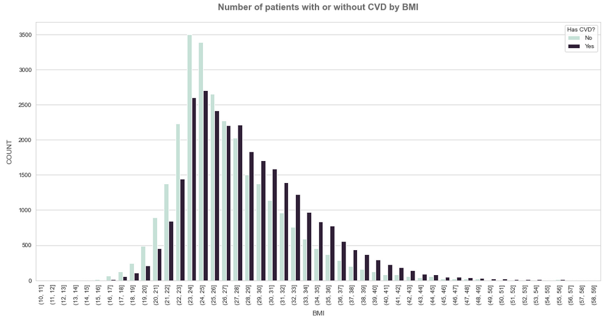
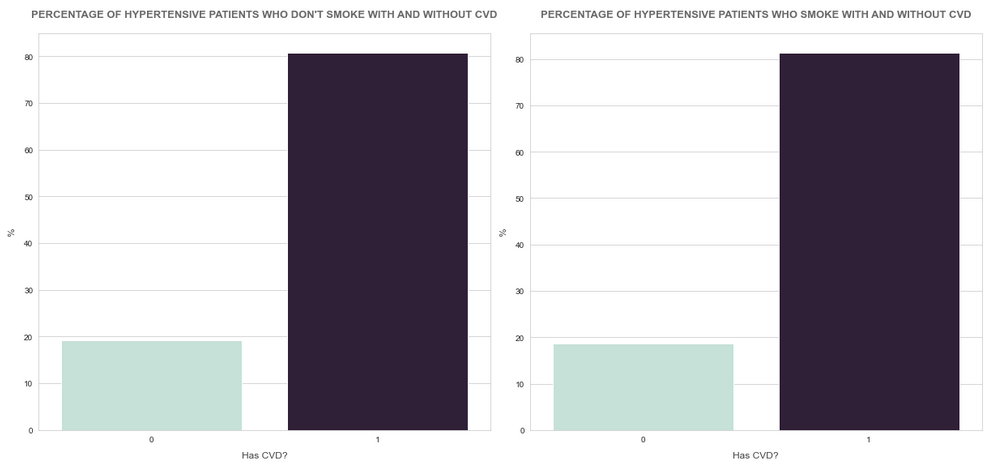
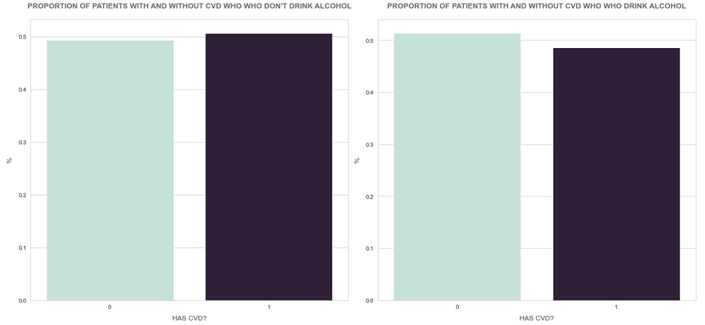

# Cardiovascular Disease Detection

<a href='https://br.freepik.com/fotos/coracao'>Criado por jcomp - br.freepik.com</a>

## This project aims to build a Machine Learning Model to detect cardiovascular disease in early stages.

#### Made by Kattson Bastos.

Note: if something goes wrong when opening the notebook, please try [this link](https://nbviewer.jupyter.org/github/KattsonBastos/cardio_disease_detection/tree/main/notebooks/).

---
# 1. Business Problem

Cardio Catch Diseases is a company specialized in detecting heart disease in the early stages. Its business model lies in offering an **early diagnosis** of cardiovascular disease for a certain price.

Currently, the diagnosis is manually made by a team of specialists with and accuracy that varies between 55% and 65%, due to the complexity of the diagnosis and also the fatigue of the team who take turns to minimize the risks. The cost of each diagnosis, including the devices and the payroll of the analysts, is around $1,000.00.

The price of the diagnosis, paid by the client, varies according to the precision achieved by the team of specialists.

| Exam Accuracy | Price          | Rules                                    | Example                         |
|:--------------|:---------------|:-----------------------------------------|:--------------------------------|
| Above 50%     | min \$500\.00  | \+\$500 for each additional 5% precision | Precision = 55% \-> \$1,000\.00 |
| Up to 50%     | $0\.00         | N/A                                      | N/A                             |

Thus, we see that **different values in the exam precision**, given by the team of specialists, make the company either have a profitable operation, revenue greater than the cost, or an operation with a loss, revenue less than the cost. This instability of the diagnosis makes the company to have an **unpredictable cashflow**.

## 1.1. What do we have to do?
We have to develop a tool capable of classify patients with CVD with a stable accuracy and report the following:

1. What's the accuracy and the precision of the tool?
2. How much profit will Cardio Catch Diseases have with the new tool?
3. How Reliable is the result given by the new tool? 

---
# 2. Business Assumptions.

The assumptions about the business problem is as follows(taken from [this website](https://www.who.int/news-room/fact-sheets/detail/cardiovascular-diseases-(cvds))):

- **CVDs are the number 1 cause of death globally**: more people die annually from CVDs than from any other cause.
- An estimated **17.9 million** people died from CVDs in 2016, representing 31% of all global deaths. Of these deaths, 85% are due to heart attack and stroke.
- Over three quarters of CVD deaths take place in **low- and middle-income countries**.
- Out of the **17 million** premature deaths (under the age of 70) due to noncommunicable diseases in 2015, **82%** are in low- and middle-income countries, and 37% are caused by CVDs.
- Most cardiovascular diseases can be **prevented by addressing behavioural risk factors** such as tobacco use, unhealthy diet and obesity, physical inactivity and harmful use of alcohol using population-wide strategies.
- People with cardiovascular disease or who are at high cardiovascular risk (due to the presence of one or more risk factors such as hypertension, diabetes, 

---
# 3. Solution Strategy

My strategy to solve this challenge was:

**Step 01. Data Description:** My goal is to use statistics metrics to identify data outside the scope of business.

**Step 02. Feature Engineering:** Derive new attributes based on the original variables to better describe the phenomenon that will be modeled and also formulate some business hypothesis ir order to get business insights.

**Step 03. Data Filtering:** Filter rows and select columns that do not contain information for modeling or that do not match the scope of the business.

**Step 04. Exploratory Data Analysis:** Explore the data to find insights and better understand the impact of variables on model learning. Also, valdiate the hypothesis formulated in section 2.

**Step 05. Data Preparation:** Prepare the data so that the Machine Learning models can learn the specific behavior.

**Step 06. Feature Selection:** Selection of the most significant attributes for training the model.

**Step 07. Machine Learning Modelling:** To train some Machine Learning Models

**Step 08. Hyperparameter Fine Tunning:** Choose the best values for each of the parameters of the model selected from the previous step.

**Step 09. Convert Model Performance to Business Values:** Convert the performance of the Machine Learning model into a business result.

**Step 10. Deploy Modelo to Production:** Publish the model in a cloud environment so that other people or services can use the results to improve the business decision.

---
# 4. Top 3 Data Insights

## Hypothesis 01
The number of patients with CVD surpass the non-CVD number at the BMI of 30 (obese).

**False.** the number of patients with CVD surpass the non CVD at the BMI between 27 and 28. Thenceforth, the number of patients with CVD is always higher.

## Hypothesis 02
The proportion of hypertensive patients with CVD is higher among those who smoke.

**False.** the proportion of hypertensive patients that have CVD is almost the same between smokers and non-smokers (there are around 20% of patients with CVD).

## Hypothesis 03:
The proportion of patients with CVD is at least 20% higher among those who drink alcohol.

**False.** As observed, the proportion of patients with CVD is slightly higher among those who don't drink alcohol.

---
# 5. Machine Learning Model Applied

---
# 6. Machine Learning Modelo Performance

---
# 7. Business Results

---
# 8. Conclusions

---
# 9. Lessons Learned

---
# 10. Next Steps to Improve

---
# LICENSE

---
# All Rights Reserved - Comunidade DS 2021
